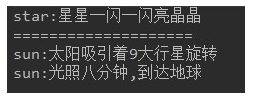
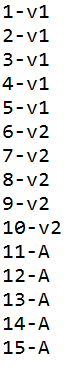

# day11_课后练习


# 编程代码题

## 第1题

* 语法点：接口
* 按步骤编写代码，效果如图所示：


* 编写步骤：

1. 定义接口A，普通类B实现接口A
2. A接口中，定义抽象方法showA。 
3. A接口中，定义默认方法showB。
4. B类中，重写showA方法
5. 测试类中，创建B类对象，调用showA方法，showB方法。

```java
package com.atguigu.test01;

public class Test01 {
	public static void main(String[] args) {
		B b = new B();
		b.showA();
		b.showB();
	}
}
interface A{
	void showA();
	default void showB(){
		System.out.println("BBB");
	}
}
class B implements A{

	@Override
	public void showA() {
		System.out.println("AAA");
	}
	
}
```


## 第2题

* 语法点：接口，多态
* 按步骤编写代码，效果如图所示：



* 编写步骤

1. 定义接口Universe，提供抽象方法doAnything。

2. 定义普通类Star，提供成员发光shine方法，打印“star:星星一闪一闪亮晶晶"

3. 定义普通类Sun，

   继承Star类，重写shine方法，打印"sun:光照八分钟，到达地球"

   实现Universe接口，实现doAnything，打印"sun:太阳吸引着9大行星旋转"

4. 测试类中，创建Star对象，调用shine方法

5. 测试类中，多态的方式创建Sun对象，调用doAnything方法，向下转型，调用shine方法。

```java
package com.atguigu.test02;

public class Test02 {
	public static void main(String[] args) {
		Star s = new Star();
		s.shine();
		
		System.out.println("======================");
		Universe u = new Sun();
		u.doAnything();
		Star sun = (Star) u;
		sun.shine();
	}
}
interface Universe{
	void doAnything();
}
class Star{
	public void shine(){
		System.out.println("star:星星一闪一闪亮晶晶");
	}
}
class Sun extends Star implements Universe{
	@Override
	public void shine(){
		System.out.println("sun:光照8分钟到达地球");
	}
	@Override
	public void doAnything() {
		System.out.println("sun:太阳吸引着9大行星旋转");
	}
	
}
```


## 第3题

* 模拟玩家选择角色。
* 定义接口FightAble：
  * 抽象方法：specialFight。
  * 默认方法：commonFight,方法中打印"普通打击"。
* 定义战士类：
  * 实现FightAble接口,重写方法中打印"武器攻击"。
* 定义法师类Mage：
  * 实现FightAble接口,重写方法中打印"法术攻击"。
* 定义玩家类Player：
  * 静态方法：FightAble select(String str)，根据指令选择角色。
    * 法力角色，选择法师。
    * 武力角色，选择战士。
* 代码实现，效果如图所示：


```java
package com.atguigu.test03;

import java.util.Scanner;

public class Test3 {
	public static void main(String[] args) {
		Scanner input = new Scanner(System.in);
		
		System.out.print("选择：");
		String role1 = input.next();
		
		FightAble f1 = Player.select(role1);
		f1.specialFight();
		f1.commonFight();
		
		System.out.println("====================");
		
		System.out.print("选择：");
		String role2 = input.next();
		
		FightAble f2 = Player.select(role2);
		f2.specialFight();
		f2.commonFight();
		
		input.close();
	}
}
interface FightAble{
	void specialFight();
	default void commonFight(){
		System.out.println("普通攻击");
	}
}
class Soldier implements FightAble{

	@Override
	public void specialFight() {
		System.out.println("武器攻击");
	}
	
}
class Mage implements FightAble{

	@Override
	public void specialFight() {
		System.out.println("法术攻击");
	}
	
}
class Player{

	public static FightAble select(String str){
		if("法力角色".equals(str)){
			return new Mage();
		}else if("武力角色".equals(str)){
			return new Soldier();
		}
		return null;
	}
	
}
```


## 第4题

* 模拟工人挑苹果。
* 定义苹果类：
  * 属性：大小，颜色。
  * 提供基本的构造方法和get方法，set方法
* 定义接口CompareAble：
  * 定义默认方法compare，挑选较大苹果。
* 定义接口实现类CompareBig。
* 定义接口实现类CompareColor。挑选红色苹果。
* 定义工人类：
  * 成员方法：挑选苹果public void pickApple(CompareAble c,Apple a1,Apple a2)。
* 测试类：
  * 创建Worker对象。
  * 创建两个Apple对象，一个Apple（5，"青色"）,一个Apple（3，"红色"）
* 代码实现，效果如图所示：


```java
package com.atguigu.test04;

public class Test04 {
	public static void main(String[] args) {
		Worker w = new Worker();
		Apple a1 = new Apple(5, "青色");
		Apple a2 = new Apple(3, "红色");
		
		w.pickApple(new CompareBig(), a1, a2);
		w.pickApple(new CompareColor(), a1, a2);
	}
}
class Apple{
	private double size;
	private String color;
	public Apple(double size, String color) {
		super();
		this.size = size;
		this.color = color;
	}
	public Apple() {
		super();
	}
	public double getSize() {
		return size;
	}
	public void setSize(double size) {
		this.size = size;
	}
	public String getColor() {
		return color;
	}
	public void setColor(String color) {
		this.color = color;
	}
	@Override
	public String toString() {
		return size + "-" + color;
	}
	
}
interface CompareAble{
	default void compare(Apple a1,Apple a2){
		System.out.println("默认挑大的：");
		if(a1.getSize() > a2.getSize()){
			System.out.println(a1);
		}else{
			System.out.println(a2);
		}
	}
}
class CompareBig implements CompareAble{
	
}
class CompareColor  implements CompareAble{

	@Override
	public void compare(Apple a1, Apple a2) {
		System.out.println("挑红的：");
		if("红色".equals(a1.getColor())){
			System.out.println(a1);
		}
		if("红色".equals(a2.getColor())){
			System.out.println(a2);
		}
	}
	
}
class Worker{
	public void pickApple(CompareAble c,Apple a1,Apple a2){
		c.compare(a1, a2);
	}
}
```


## 第5题

* 模拟接待员接待用户，根据用户id，给用户分组。

* 定义用户类：
  * 属性：用户类型，用户id
  * 提供基本的构造方法和get方法，set方法
* 定义接口Filter：
  * 提供抽象方法filterUser（User u）
* 定义实现类V1Filter，实现抽象方法，将用户设置为v1
* 定义实现类V2Filter，实现抽象方法，将用户设置为v2
* 定义实现类AFilter，实现抽象方法，将用户设置为A
* 定义接待员类Receptionist：
  * 属性：接口Filter
  * 提供基本的构造方法和get方法，set方法
  * 成员方法：接待用户方法，设置用户类型。
* 测试类：
  * 初始化15个User对象，id为1-15。
  * 创建三个接待员对象。
    * 第一个接待员，设置接待规则，将1-5号用户类型设置为v1。
    * 第二个接待员，设置接待规则，将6-10号用户类型设置为v2。
    * 第三个接待员，设置接待规则，将11-15号用户类型设置为A。
  * 遍历数组，给用户分区。

* 代码实现，效果如图所示：



```java
package com.atguigu.test05;

public class Test05 {
	public static void main(String[] args) {
		User[] all = new User[15];
		for (int i = 0; i < all.length; i++) {
			all[i] = new User(null,i+1);
		}
		V1Filter v1F = new V1Filter();
		V2Filter v2F = new V2Filter();
		AFilter aF = new AFilter();
		Receptionist r1 = new Receptionist(v1F);
		for (int i = 0; i < 5; i++) {
			r1.recept(all[i]);
		}
		Receptionist r2 = new Receptionist(v2F);
		for (int i = 5; i < 10; i++) {
			r2.recept(all[i]);
		}
		Receptionist r3 = new Receptionist(aF);
		for (int i = 10; i < 15; i++) {
			r3.recept(all[i]);
		}
		for (int i = 0; i < all.length; i++) {
			System.out.println(all[i]);
		}
	}
}
class User{
	private String type;
	private int id;
	public User(String type, int id) {
		super();
		this.type = type;
		this.id = id;
	}
	public String getType() {
		return type;
	}
	public void setType(String type) {
		this.type = type;
	}
	public int getId() {
		return id;
	}
	public void setId(int id) {
		this.id = id;
	}
	@Override
	public String toString() {
		return id + "-" + type;
	}
}
interface Filter{
	void filterUser(User u);
}

class V1Filter implements Filter{

	@Override
	public void filterUser(User u) {
		u.setType("v1");
	}
	
}
class V2Filter implements Filter{

	@Override
	public void filterUser(User u) {
		u.setType("v2");
	}
	
}
class AFilter implements Filter{

	@Override
	public void filterUser(User u) {
		u.setType("A");
	}
	
}

class Receptionist{
	private Filter filter;

	public Receptionist(Filter filter) {
		super();
		this.filter = filter;
	}

	public Filter getFilter() {
		return filter;
	}

	public void setFilter(Filter filter) {
		this.filter = filter;
	}
	public void recept(User u){
		if(u.getType() != null){
			return ;
		}
		filter.filterUser(u);
	}
}

```

## 第6题

- 知识点：抽象类
- 语法点：继承，抽象类
- 按步骤编写代码，效果如图所示：


编写步骤：

1. 定义抽象类A，抽象类B继承A，普通类C继承B
2. A类中，定义成员变量numa，赋值为10，抽象showA方法。
3. B类中，定义成员变量numb，赋值为20，抽象showB方法。
4. C类中，定义成员变量numc，赋值为30，重写showA方法，打印numa，重写showB方法，打印numb，定义showC方法，打印numc。
5. 测试类Test09中，创建C对象，调用showA方法，showB方法，showC方法。

```java
package com.atguigu.test09;

public class Test09 {
	public static void main(String[] args) {
		C c = new C();
		c.showA();
		c.showB();
		c.showC();
	}
}
abstract class A{
	protected int numa = 10;
	public abstract void showA();
}
abstract class B extends A{
	protected int numb = 20;
	public abstract void showB();
}
class C extends B{
	private int numc = 30;

	@Override
	public void showB() {
		System.out.println("B类中numb:" + numb);
	}

	@Override
	public void showA() {
		System.out.println("A类中numa:" + numa);
	}
	
	public void showC(){
		System.out.println("C类中numc:" + numc);
	}
}
```

## 第7题

知识点：抽象类

案例：

​	1、声明抽象父类Person，包含抽象方法public abstract void pee();

​	2、声明子类Woman，重写抽象方法，打印坐着尿

​	3、声明子类Man，重写抽象方法，打印站着上尿

​	4、声明测试类Test10，创建Person数组，存放Woman和Man对象，并遍历数组，调用pee()方法

```java
package com.atguigu.test10;

public abstract class Person {
	public abstract void pee();
}
```

```java
package com.atguigu.test10;

public class Man extends Person{

	@Override
	public void pee() {
		System.out.println("男人站着尿");
	}

}

```

```java
package com.atguigu.test10;

public class Woman extends Person{

	@Override
	public void pee() {
		System.out.println("女人坐着尿");
	}

}
```

```java
package com.atguigu.test10;

public class Test10 {
	public static void main(String[] args) {
		Person[] all = new Person[2];
		all[0] = new Woman();
		all[1] = new Man();
		
		for (int i = 0; i < all.length; i++) {
			all[i].pee();
		}
	}
}

```


## 第8题

知识点：抽象类

案例：

​	1、声明抽象父类Person，包含抽象方法public abstract void eat();

​	2、声明子类中国人Chinese，重写抽象方法，打印用筷子吃饭

​	3、声明子类美国人American，重写抽象方法，打印用刀叉吃饭

​	4、声明子类印度人Indian，重写抽象方法，打印用手抓饭

​	5、声明测试类Test11，创建Person数组，存储各国人对象，并遍历数组，调用eat()方法

```java
package com.atguigu.test11;

public class Test11 {

	public static void main(String[] args) {
		Person[] all = new Person[3];
		all[0] = new Chinese();
		all[1] = new American();
		all[2] = new Indian();
		
		for (int i = 0; i < all.length; i++) {
			all[i].eat();
		}
	}

}
abstract class Person{
	public abstract void eat();
}
class Chinese extends Person{

	@Override
	public void eat() {
		System.out.println("中国人用筷子吃饭");
	}
	
}
class American extends Person{

	@Override
	public void eat() {
		System.out.println("美国人用刀叉吃饭");
	}
	
}
class Indian extends Person{

	@Override
	public void eat() {
		System.out.println("印度人用手抓饭");
	}
	
}
```


## 第9题

知识点：Object类的方法

案例：

​	1、声明三角形类，包含a,b,c三边

​	（1）属性私有化，提供无参，有参构造，提供get/set

​	（2）重写：toString()

​	（3）重写：hashCode和equals方法

​	（4）编写  public double getArea()：求面积方法

​	（5）编写 public double getPiremeter()：求周长方法

​	2、声明测试类Test12，在测试类中创建两个三角形对象，调用以上方法进行测试

```java
package com.atguigu.test12;

public class Test12 {
	public static void main(String[] args) {
		Triangle t1 = new Triangle(3,4,5);
		Triangle t2 = new Triangle(3,3,3);
		
		System.out.println(t1);
		System.out.println(t2);
		
		System.out.println("t1的面积：" + t1.getArea());
		System.out.println("t1的周长：" + t1.getPiremeter());
		System.out.println("t2的面积：" + t2.getArea());
		System.out.println("t2的面积：" + t2.getPiremeter());
		
		System.out.println("t1和t2是否相同：" + t1.equals(t2));
	}
}
class Triangle{
	private double a;
	private double b;
	private double c;
	public Triangle(double a, double b, double c) {
		super();
		this.a = a;
		this.b = b;
		this.c = c;
	}
	public Triangle() {
		super();
	}
	public double getA() {
		return a;
	}
	public void setA(double a) {
		this.a = a;
	}
	public double getB() {
		return b;
	}
	public void setB(double b) {
		this.b = b;
	}
	public double getC() {
		return c;
	}
	public void setC(double c) {
		this.c = c;
	}
	@Override
	public String toString() {
		return "三角形的三条边：a=" + a + ", b=" + b + ", c=" + c;
	}
	@Override
	public int hashCode() {
		final int prime = 31;
		int result = 1;
		long temp;
		temp = Double.doubleToLongBits(a);
		result = prime * result + (int) (temp ^ (temp >>> 32));
		temp = Double.doubleToLongBits(b);
		result = prime * result + (int) (temp ^ (temp >>> 32));
		temp = Double.doubleToLongBits(c);
		result = prime * result + (int) (temp ^ (temp >>> 32));
		return result;
	}
	@Override
	public boolean equals(Object obj) {
		if (this == obj)
			return true;
		if (obj == null)
			return false;
		if (getClass() != obj.getClass())
			return false;
		Triangle other = (Triangle) obj;
		if (Double.doubleToLongBits(a) != Double.doubleToLongBits(other.a))
			return false;
		if (Double.doubleToLongBits(b) != Double.doubleToLongBits(other.b))
			return false;
		if (Double.doubleToLongBits(c) != Double.doubleToLongBits(other.c))
			return false;
		return true;
	}
	public double getArea(){
		double p = (a + b + c)/2;
		return Math.sqrt(p * (p-a) * (p-b) * (p-c));
	}
	public double getPiremeter(){
		return a + b + c;
	}
}
```


## 第10题

案例：

​	1、在com.atguigu.test13包中声明员工类、程序员类、设计师类、架构师类，


- 员工类属性：编号、姓名、年龄、薪资

- 程序员类属性：编程语言，默认都是"java"

- 设计师类属性：奖金

- 架构师类属性：持有股票数量

  要求：属性私有化，无参有参构造，get/set，getInfo方法（考虑重写）

  

  2、在com.atguigu.test13包中声明Test13测试类

  （1）在main中有一些常量和一个二维数组

  ```
  final int EMPLOYEE = 10;//表示普通员工
  final int PROGRAMMER = 11;//表示程序员
  final int DESIGNER = 12;//表示设计师
  final int ARCHITECT = 13;//表示架构师
      
  String[][] EMPLOYEES = {
          {"10", "1", "段誉", "22", "3000"},
          {"13", "2", "令狐冲", "32", "18000", "15000", "2000"},
          {"11", "3", "任我行", "23", "7000"},
          {"11", "4", "张三丰", "24", "7300"},
          {"12", "5", "周芷若", "28", "10000", "5000"},
          {"11", "6", "赵敏", "22", "6800"},
          {"12", "7", "张无忌", "29", "10800","5200"},
          {"13", "8", "韦小宝", "30", "19800", "15000", "2500"},
          {"12", "9", "杨过", "26", "9800", "5500"},
          {"11", "10", "小龙女", "21", "6600"},
          {"11", "11", "郭靖", "25", "7100"},
          {"12", "12", "黄蓉", "27", "9600", "4800"}
      };
  ```

  （2）创建一个员工数组

  （3）根据以上数据，初始化员工数组

  提示：把字符串转为int和double类型的值，可以使用如下方式：

  ```java
  String idStr = "1";
  int id = Integer.parseInt(idStr);
  
  String salaryStr = "7300";
  double salary = Double.parseDouble(salaryStr);
  ```

  （4）遍历数组，使用如下格式

  ```
  编号	姓名	年龄	薪资	语言	奖金	股票
  .....
  ```

  ```java
  package com.atguigu.test13;
  
  public class Employee {
  	private int id;
  	private String name;
  	private int age;
  	private double salary;
  	
  	public Employee() {
  		super();
  	}
  
  	public Employee(int id, String name, int age, double salary) {
  		super();
  		this.id = id;
  		this.name = name;
  		this.age = age;
  		this.salary = salary;
  	}
  
  	public int getId() {
  		return id;
  	}
  
  	public void setId(int id) {
  		this.id = id;
  	}
  
  	public String getName() {
  		return name;
  	}
  
  	public void setName(String name) {
  		this.name = name;
  	}
  
  	public int getAge() {
  		return age;
  	}
  
  	public void setAge(int age) {
  		this.age = age;
  	}
  
  	public double getSalary() {
  		return salary;
  	}
  
  	public void setSalary(double salary) {
  		this.salary = salary;
  	}
  	
  	public String getInfo(){
  		return id + "\t" + name + "\t" + age + "\t" + salary;
  	}
  }
  ```

  ```java
  package com.atguigu.test13;
  
  public class Programmer extends Employee{
  	private String language = "java";
  
  	public Programmer() {
  		super();
  	}
  
  	public Programmer(int id, String name, int age, double salary) {
  		super(id, name, age, salary);
  	}
  
  	public Programmer(int id, String name, int age, double salary, String language) {
  		super(id, name, age, salary);
  		this.language = language;
  	}
  
  	public String getLanguage() {
  		return language;
  	}
  
  	public void setLanguage(String language) {
  		this.language = language;
  	}
  
  	@Override
  	public String getInfo() {
  		return super.getInfo() + "\t" + language;
  	}
  	
  }
  
  ```

  ```java
  package com.atguigu.test13;
  
  public class Designer extends Programmer {
  	private double bonus;
  
  	public Designer() {
  		super();
  	}
  
  	public Designer(int id, String name, int age, double salary, double bonus) {
  		super(id, name, age, salary);
  		this.bonus = bonus;
  	}
  
  	public Designer(int id, String name, int age, double salary, String language, double bonus) {
  		super(id, name, age, salary, language);
  		this.bonus = bonus;
  	}
  
  	public double getBonus() {
  		return bonus;
  	}
  
  	public void setBonus(double bonus) {
  		this.bonus = bonus;
  	}
  
  	@Override
  	public String getInfo() {
  		return super.getInfo()+ "\t" + bonus;
  	}
  	
  }
  
  ```

  ```java
  package com.atguigu.test13;
  
  public class Architect extends Designer {
  	private int stock;
  
  	public Architect() {
  		super();
  	}
  
  	public Architect(int id, String name, int age, double salary, double bonus, int stock) {
  		super(id, name, age, salary, bonus);
  		this.stock = stock;
  	}
  
  	public Architect(int id, String name, int age, double salary, String language, double bonus, int stock) {
  		super(id, name, age, salary, language, bonus);
  		this.stock = stock;
  	}
  
  	public int getStock() {
  		return stock;
  	}
  
  	public void setStock(int stock) {
  		this.stock = stock;
  	}
  
  	@Override
  	public String getInfo() {
  		return super.getInfo() + "\t" + stock;
  	}
  	
  }
  
  ```

  ```java
  package com.atguigu.test13;
  
  public class Test13 {
  
  	public static void main(String[] args) {
  		final int EMPLOYEE = 10;//表示普通员工
  		final int PROGRAMMER = 11;//表示程序员
  		final int DESIGNER = 12;//表示设计师
  		final int ARCHITECT = 13;//表示架构师
  		    
  		String[][] EMPLOYEES = {
  		        {"10", "1", "段誉", "22", "3000"},
  		        {"13", "2", "令狐冲", "32", "18000", "15000", "2000"},
  		        {"11", "3", "任我行", "23", "7000"},
  		        {"11", "4", "张三丰", "24", "7300"},
  		        {"12", "5", "周芷若", "28", "10000", "5000"},
  		        {"11", "6", "赵敏", "22", "6800"},
  		        {"12", "7", "张无忌", "29", "10800","5200"},
  		        {"13", "8", "韦小宝", "30", "19800", "15000", "2500"},
  		        {"12", "9", "杨过", "26", "9800", "5500"},
  		        {"11", "10", "小龙女", "21", "6600"},
  		        {"11", "11", "郭靖", "25", "7100"},
  		        {"12", "12", "黄蓉", "27", "9600", "4800"}
  		    };
  		
  		Employee[] all = new Employee[EMPLOYEES.length];
  		for (int i = 0; i < all.length; i++) {
  			int type = Integer.parseInt(EMPLOYEES[i][0]);
  			int id = Integer.parseInt(EMPLOYEES[i][1]);
  			String name = EMPLOYEES[i][2];
  			int age = Integer.parseInt(EMPLOYEES[i][3]);
  			double salary = Double.parseDouble(EMPLOYEES[i][4]);
  			
  			if(type == EMPLOYEE){
  				all[i] = new Employee(id, name, age, salary);
  			}else if(type == PROGRAMMER){
  				all[i] = new Programmer(id, name, age, salary);
  			}else if(type == DESIGNER){
  				double bonus = Integer.parseInt(EMPLOYEES[i][5]);
  				all[i] = new Designer(id, name, age, salary, bonus);
  			}else if(type == ARCHITECT){
  				double bonus = Double.parseDouble(EMPLOYEES[i][5]);
  				int stock = Integer.parseInt(EMPLOYEES[i][6]);
  				all[i] = new Architect(id, name, age, salary, bonus, stock);
  			}
  		}
  		
  		System.out.println("编号\t姓名\t年龄\t薪资\t语言\t奖金\t股票");
  		for (int i = 0; i < all.length; i++) {
  			System.out.println(all[i].getInfo());
  		}
  	}
  
  }
  
  ```

  